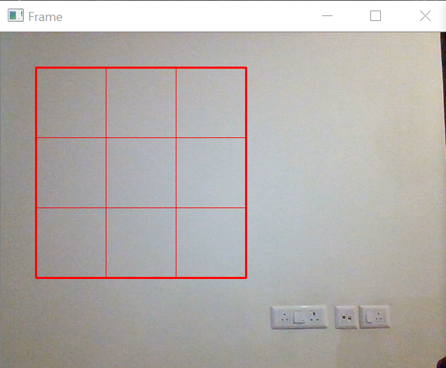
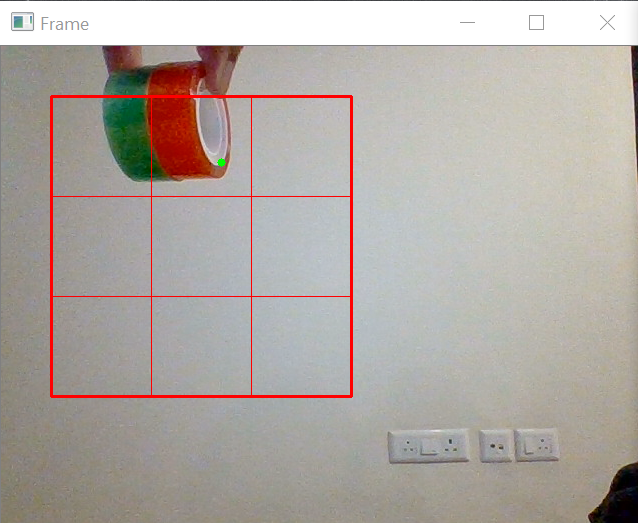
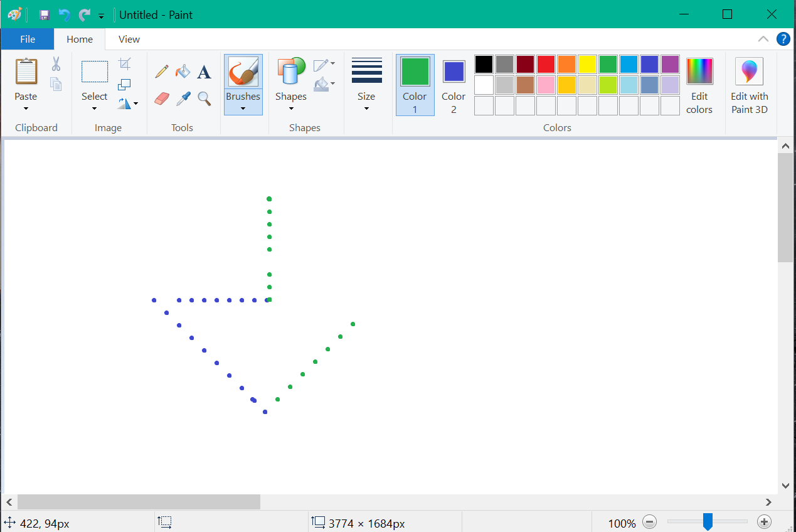

# Computer_Vision_Mouse

This computer vision based mouse uses a web camera to control and command the cursor on a computer screen with the help of a reference mark placed inside the Region of Interest (ROI) which is going to be in a grid format that basically aids in the conversion of the marker's location to cursor movement. The ROI is where we'll do all of the mouse work and where our sensor will detect the marker. 
  

In order to move the cursor on the screen the user simply uses a specific color (Red in this case) within the viewing area of the camera. The video generated by the camera is analyzed using computer vision techniques and the computer moves the cursor according to the color movements that the user makes. This computer vision based mouse also have a feature of Right-click and Left-click. For the left-click function, Green color has been used for Right-click function, Blue color has been used. This means that if the user introduces either Green or Blue color in the viewing area of the camera then the respective function gets execured.

In order to implement this program we need to have the following libraries installed:

1.Python3

2.pip

3.Opencv

4.Matplotlib

5.Numpy

6.pyautogui

The video transmitted by the web camera is analyzed image by image in real time. 
We use the method of detection and tracking approach which is based on motion analysis which can be achieved by using the techniques like edge detection and color analysis. We will achieve it with using the pyautogui library to move the mouse based on its colors.

<b>Red</b> - Cursor movement

<b>Green</b> - Left-Click

<b>Blue</b> - Rght-click

<b>Demo</b>
 
We have used Microsoft Paint for demonstration purpose. Left Click on the paint brush is set to Green color and the Right Click is set to Blue color so that it is easier demonstrate the functionalities.
When a Red color object is placed in one of the 9 possible sub-regions of the ROI, the cursor moves in that respective direction on the desktop screen, the distance of the movement is preset in the python code. 
When a Blue color object is introduced alongside a Red object, a Blue colored dotted line is made, this means that the right button on the mouse is clicked in intervals.
Similarly, this is applicable for a Green object as well.
 

